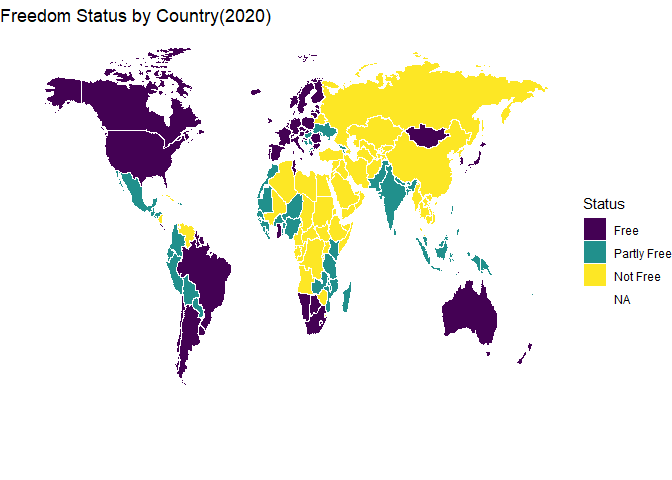
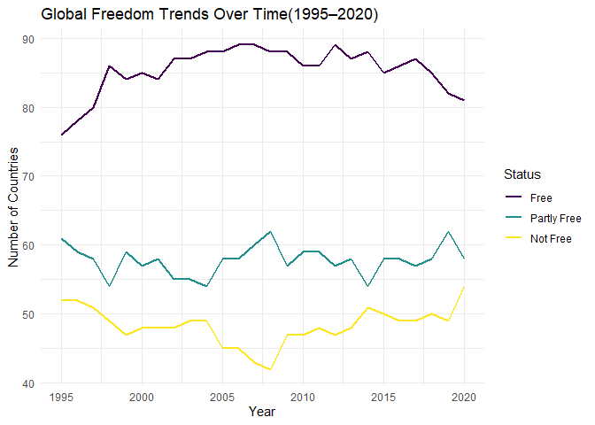

# Read Me


# Global Freedom

# Project Overview

This analysis uses the “Freedom in the World” dataset from Freedom House
and the United Nations by way of Arthur Cheib. The dataset provides
annual country specific information on political rights and civil
liberties from 1972 onward. It includes measures of freedom across 195
countries and 15 territories. It is the standard-setting comparative
assessment of global political rights and civil liberties.

### Research Question

How do civil liberties and political rights vary across countries and
regions, and how has global freedom changed over time?

### Variables Used

country: The name of the country

year: The year of observation

CL (Civil Liberties): A score ranging from 1 to 7, where 1 represents
the highest level of freedom (most free) and 7 represents the lowest
level of freedom

PR (Political Rights): A score ranging from 1 to 7, where 1 indicates
strong political rights and 7 indicates very limited or absent political
rights

Status: The overall classification of a country’s freedom level(Free
(F), Partly Free (PF), or Not Free (NF) )

### Key Findings

- Free countries are mostly in North America, Europe and Oceania

- Not Free countries are more common in Africa and parts of the Middle
  East and Asia

- Global freedom was at its highest between 2005 and 2010, followed by a
  slight decline in more recent years.

- Both Civil Liberties and Political Rights follow very similar
  patterns. Both variables have higher scores in recent years,
  suggesting a decrease in overall freedom.

# Primary Visualizations

### Freedom Status by Country(2020)

How is freedom status distributed across countries in 2020?

``` r
freedom_2020 <- freedom_df |>
  filter(year == 2020) |>
  mutate(Status = factor(Status,
                         levels = c("F", "PF", "NF"),
                         labels = c("Free", "Partly Free", "Not Free")))

world_map <- map_data("world")

world_joined <- left_join(world_map, freedom_2020, join_by(region == country))

ggplot(world_joined, aes(x = long, y = lat, group = group, fill = Status, label = region)) +
  geom_polygon(colour="white", linewidth=0.1) +
  theme_void() +
  labs(
    title= "Freedom Status by Country(2020)",
    fill="Status"
  ) + 
  scale_fill_viridis_d(
    labels = c("Free", "Partly Free", "Not Free")
  )
```



From the map, we can clearly see that Free countries are concentrated in
North America, Europe, and Oceania, while Not Free countries are more
common in Africa and parts of the Middle East and Asia.

### Global Freedom Trends Over Time

How has the number of Free, Partly Free, and Not Free countries changed
globally from 1995 to 2020 ?

``` r
ggplot(data=status_trend, aes(x = year, y = count, colour = Status)) +
  geom_line(linewidth = 1) +
  scale_color_viridis_d()+
  labs(
    title = "Global Freedom Trends Over Time(1995–2020)",
    x = "Year",
    y = "Number of Countries"
  ) +
  theme_minimal()
```



From the line plot, the period between 2005 and 2010 stands out as a
strong period for global freedom. During this time, the number of Free
countries is higher while the number of Not Free countries is lower.
Partly Free countries are also relatively higher as well.
